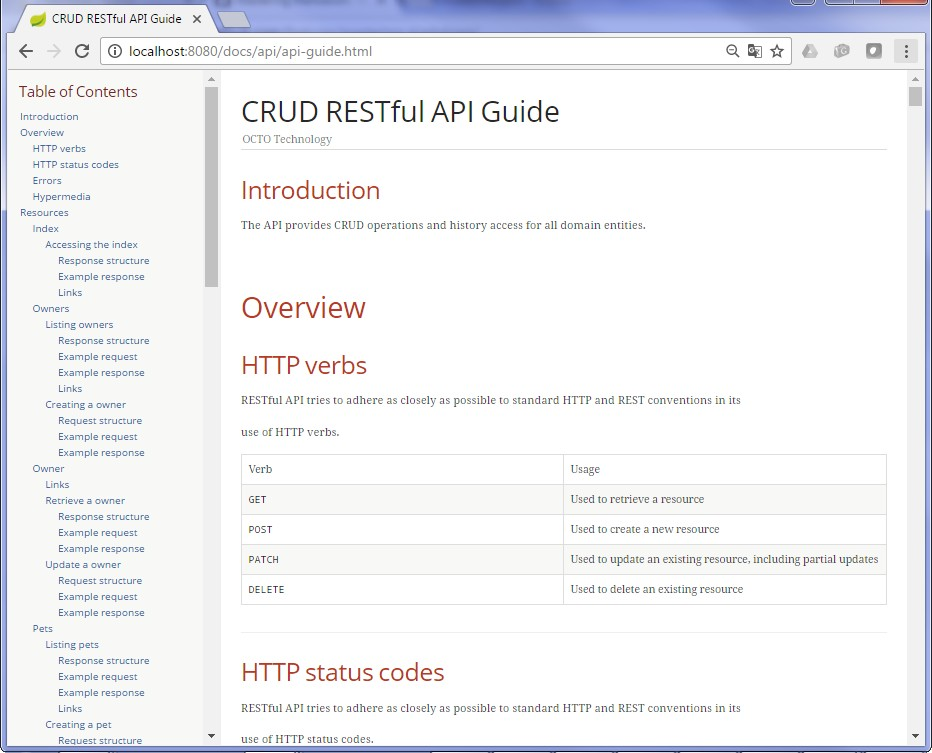

#**petclinic-api-doc** : Rest API and documentation generation

Use the crud-maven-plugin to generate the Rest API and the documentation for all entities.

Build the sample
================
Run ``mvn clean install``

Run the sample
==============
Run ``mvn spring-boot:run``

Test the sample
=============
* Test the API (see [petclinic-api](../petclinic-api/README.md#test-the-api) for details)
* Browse the generated documentation at ``http://localhost:8080/doc`` you will be redirected to the API documentation page :


How it works ?
==============

### Project dependencies

In addition to the dependencies needed for the API (detailed [here](../petclinic-api/README.md#project-dependencies)), the generation of the documentation needs the Spring Rest Docs dependencies as shown below (extracted from [pom.xml](pom.xml):
```xml
<!-- Start dependencies for API documentation generation -->
<dependency>
    <groupId>com.octo.tools</groupId>
    <artifactId>crud-generator-utils-tests</artifactId>
    <version>0.0.2-SNAPSHOT</version>
    <scope>test</scope>
</dependency>               
<dependency>
    <groupId>joda-time</groupId>
    <artifactId>joda-time</artifactId>
    <scope>test</scope>
</dependency>
<dependency>
    <groupId>org.springframework.restdocs</groupId>
    <artifactId>spring-restdocs-mockmvc</artifactId>
    <scope>test</scope>
</dependency>
<dependency>
    <groupId>org.springframework.boot</groupId>
    <artifactId>spring-boot-starter-test</artifactId>
    <scope>test</scope>
</dependency>
<dependency>
    <groupId>org.springframework</groupId>
    <artifactId>spring-test</artifactId>
    <scope>test</scope>
</dependency>
<!-- End of dependencies for API documentation generation -->
```

### Java code

The only Java class in the **main** code is the [Application](src/main/java/com/octo/tools/samples/petclinic/Application.java) class that initialize the Spring Boot context. The same annotations as in the [petclinic-api](../petclinic-api/README.md#java-code) sample are used. The only difference resides on the @componentScan annotation : *@ComponentScan({"com.octo.tools.crud.doc"})* is used in petclinic-api-doc in order to enable the controller enabling the /doc redirection to the generated documentation ([ApiDocsController](../../crud-generator-utils/src/main/java/com/octo/tools/crud/doc/ApiDocsController.java)) and the support of the /doc resource at the root of the API ([DocResourceProcessor](https://github.com/yanndemel/crud-rest-gen/blob/master/crud-generator-utils/src/main/java/com/octo/tools/crud/doc/DocResourceProcessor.java)).

You will find in the **test** code 3 classes with empty body extending classes provided by [crud-generator-utils-tests](../../crud-generator-utils-tests) and annotated with ``@ContextConfiguration(classes = Application.class)`` in order to load the Spring context of the main application for the test :

* [PetClinicADocEntityGenerator](src/test/java/com/octo/tools/samples/petclinic/PetClinicADocEntityGenerator.java) which extends [ADocEntityGenerator](https://github.com/yanndemel/crud-rest-gen/blob/master/crud-generator-utils-tests/src/main/java/com/octo/tools/crud/doc/ADocEntityGenerator.java)
* [PetClinicBaseApiDocumentation](src/test/java/com/octo/tools/samples/petclinic/PetClinicBaseApiDocumentation.java) which extends [BaseApiDocumentation](src/main/java/com/octo/tools/crud/doc/BaseApiDocumentation.java)
* [PetClinicEntitiesApiDocumentation](src/test/java/com/octo/tools/samples/petclinic/PetClinicEntitiesApiDocumentation.java) which extends [EntitiesApiDocumentation](https://github.com/yanndemel/crud-rest-gen/blob/master/crud-generator-utils-tests/src/main/java/com/octo/tools/crud/doc/EntitiesApiDocumentation.java)

As in the petclinic-api sample, no application.properties file is used. 

### crud-maven-plugin configuration

The same configuration as in the [petclinic-api](../petclinic-api#crud-maven-plugin-configuration) project is used for the generation of the Rest API source code. The generation of the documentation of the API is not part of the plugin : it uses only the classes located in crud-generator-utils-tests, which use only the Spring Rest Docs framework.

### Spring Rest Docs configuration

4 steps are involved in the generation of the API :

#### Step 1 : Unpack crud-generator-utils-tests jar so that asciidoctor-maven-plugin can locate the .adoc template in the sourceDirectory :
```xml
<!-- Unpacking crud-generator-utils-tests jar so that asciidoctor-maven-plugin can locate the .adoc template in the sourceDirectory -->
<plugin>
    <groupId>org.apache.maven.plugins</groupId>
    <artifactId>maven-dependency-plugin</artifactId>
    <executions>
        <execution>
            <id>unpack</id>
            <phase>generate-test-sources</phase>
            <goals>
                <goal>unpack</goal>
            </goals>
            <configuration>
                <artifactItems>
                    <artifactItem>
                        <groupId>com.octo.tools</groupId>
                        <artifactId>crud-generator-utils-tests</artifactId>
                        <version>0.0.2-SNAPSHOT</version>
                        <type>jar</type>
                        <overWrite>true</overWrite>
                        <outputDirectory>${project.build.directory}/crud-tests</outputDirectory>
                    </artifactItem>
                </artifactItems>
            </configuration>
        </execution>
    </executions>
</plugin>
```
#### Step 2 : Tests execution

Please refer at the documentation of the [crud-generator-utils-tests](../../crud-generator-utils-tests/README.md#api-documentation-generation-unit-tests) for the details of the generation of the documentation.
```xml
<!-- Tests execution : you just have to extend existing test classes located in crud-generator-utils-tests -->
<plugin>
    <groupId>org.apache.maven.plugins</groupId>
    <artifactId>maven-surefire-plugin</artifactId>
    <configuration>
        <includes>
            <!-- Tests generating the API documentation -->
            <include>**/*Documentation.java</include>
            <include>**/*EntityGenerator.java</include>
        </includes>                 
        <systemPropertyVariables>
            <!-- Used by BaseApiDocumentation : package name of the repository classes -->
            <packageName>${packageName}</packageName>
            <!-- Used by BaseApiDocumentation : set to true if you have generated audit controllers with crud-maven-plugin -->
            <audit>false</audit>
            <!-- Used by BaseApiDocumentation : set to true if you add "com.octo.tools" to the @ComponentScan annotation on your @SpringBootApplication class -->
            <doc>true</doc>                        
        </systemPropertyVariables>
    </configuration>
</plugin>
```
#### Step 3 : Generation of the API documentation
```xml
<!-- Generation of the API documentation -->
<plugin>
    <groupId>org.asciidoctor</groupId>
    <artifactId>asciidoctor-maven-plugin</artifactId>
    <version>1.5.2</version>
    <executions>
        <execution>
            <id>generate-docs</id>
            <phase>prepare-package</phase>
            <goals>
                <goal>process-asciidoc</goal>
            </goals>
            <configuration>
                <!-- Template located in the unpacked test dependency crud-generator-utils-tests -->
                <sourceDirectory>${project.build.directory}/crud-tests/asciidoc</sourceDirectory>
                <backend>html</backend>
                <doctype>book</doctype>
                <attributes>
                    <snippets>${snippetsDirectory}</snippets>
                </attributes>
            </configuration>
        </execution>
    </executions>
</plugin>
```
#### Step 4 : Copy of the generated documentation to static/docs/api

```xml
<!-- Copy of the generated documentation to static/docs/api -->
<plugin>
    <artifactId>maven-resources-plugin</artifactId>
    <executions>
        <execution>
            <id>copy-resources-doc</id>
            <phase>prepare-package</phase>
            <goals>
                <goal>copy-resources</goal>
            </goals>
            <configuration>
                <outputDirectory>
                    ${project.build.outputDirectory}/static/docs/api
                </outputDirectory>
                <resources>
                    <resource>
                        <directory>
                            ${project.build.directory}/generated-docs
                        </directory>
                    </resource>
                </resources>
            </configuration>
        </execution>
    </executions>
</plugin>
```

### Generated sources

The same sources as in petclinic-api project are generated : see [README](../petclinic-api/README.md#generated-sources) for details


> **Note** : the project is packaged as a "war" in order to be deployable in any servlet container like Tomcat
