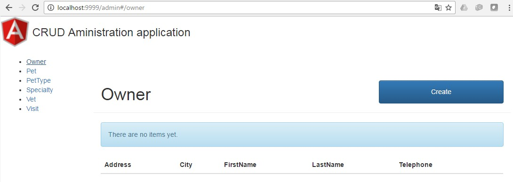

# petclinic-web : CRUD Web administration UI generation

Use **crud-maven-plugin:crudweb** to generate an **Angular JS application** for administrating the [petclinic-model](../petclinic-model) using the [petclinic-api](../petclinic-api) as backend.

Build the sample
================
Run ``mvn clean install``

Run the sample
==============
1. Start the [petclinic-api](../petclinic-api/README.md#run-the-sample) (at the root of /petclinic-api)
2. Run ``mvn spring-boot:run -Dserver.port=9999`` (at the root of /petclinic-web)

Test the Web application
========================
1. Test if the API is [up and running](../petclinic-api/README.md#test-the-api)
2. Browse to the URL ``localhost:9999/admin`` and click oin the "Owner" link in the menu :


You can now make CRUD operations on your entities using the Web interface.

How it works ?
==============

### Project dependencies

In addition to the standard Spring Boot dependencies (spring-boot-starter-data-rest, and spring-boot-starter-tomcat), one dependency is needed for building the project :

* *crud-generator-utils* that contains the controller ([AdminController](../../crud-generator-utils/src/main/java/com/octo/tools/crud/admin/AdminController.java)) redirecting /admin to the main page

Extract from pom.xml :
```xml			
<!-- Classes used by generated controllers -->
<dependency>
	<groupId>com.octo.tools</groupId>
	<artifactId>crud-generator-utils</artifactId>
	<version>0.0.2-SNAPSHOT</version>
</dependency>
```
### Java code

The only Java class is the [Application](src/main/java/com/octo/tools/samples/petclinic/Application.java) class that initialize the Spring Boot context. Following annotations are used :

* *@SpringBootApplication* to enable Spring Boot context
* *@EnableAutoConfiguration(exclude = { DataSourceAutoConfiguration.class,HibernateJpaAutoConfiguration.class,		DataSourceTransactionManagerAutoConfiguration.class })* to prevent the load of any datasource by Spring Boot
* *@ComponentScan({"com.octo.tools.crud.admin"})* to enable the /admin controller

No application.properties file is used in this sample.

### crud-maven-plugin configuration

It is located in the ``<pluginManagement>`` section of the [pom.xml](pom.xml).
The **crudweb** goal is used in this sample  (bound to the *generate-resources* phase).
```xml					
<!-- CRUD Admin Web app generation -->
<execution>
  <id>web</id>
  <phase>generate-resources</phase>
  <goals>
    <goal>crudweb</goal>
  </goals>
</execution>				
```

* *crud-maven-plugin* needs the domain classes with the associated persistence.xml as a plugin dependency in order to be able to load the EntityManagerFactory :
```xml
<dependencies>
    <!-- Your JPA domain classes (must contain persistence.xml)  -->
    <dependency>
        <groupId>com.octo.tools.samples</groupId>
        <artifactId>petclinic-model</artifactId>
        <version>0.0.2-SNAPSHOT</version>
    </dependency>                       
    <!-- To avoid errors like Unable to load 'javax.el.ExpressionFactory'. 
        Check that you have the EL dependencies on the classpath, or use ParameterMessageInterpolator 
        instead -->
    <dependency>
        <groupId>javax.el</groupId>
        <artifactId>javax.el-api</artifactId>
        <version>2.2.4</version>
    </dependency>
</dependencies>
```

* The *persistentUnitName* declared in the configuration of the plugin :
 ``<persistentUnitName>petclinic-model</persistentUnitName>``
must match name of the *persistence-unit* declared in the [*persistence.xml*](../petclinic-model/src/main/resources/META-INF/persistence.xml) : 
``<persistence-unit name="petclinic-model">``
* The *restApiUrl* declared in the configuration of the plugin is the root URL of the API (``http:localhost:8080/`` in the sample)
```xml
<configuration>
  <persistentUnitName>petclinic-model</persistentUnitName>
  <restApiUrl>${restApiUrl}</restApiUrl>						
</configuration>
```

### Generated sources

For each JPA entity, crud-maven-plugin:crudweb generates :

* 2 JS files in ``js/<entity>/`` :
 * ``<entity>_controller.js``
 * ``<entity>_module.js``
* 2 HTML files in ``partials/<entity>/`` :
 * ``<entity>_form.html``
 * ``<entity>_list.html``

The details of the Web application generation are explained in the [crud-web-generator](../../crud-web-generator) project.

All generated sources are located in ```/target/classes/static/admin```.

> **Note** : the project is packaged as a "war" in order to be deployable in any servlet container like Tomcat
